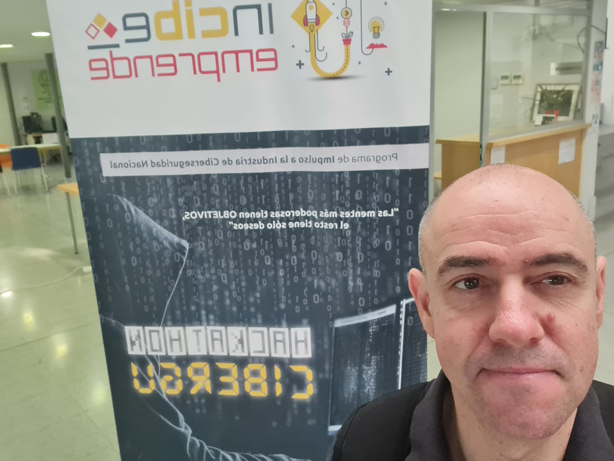

<h1 align="center" style="color:#a076f9; font-family:'Segoe UI', Arial, sans-serif; font-size:2.2em;">
   
  ISMADEV • SOLUTIONS
</h1>

  <b>Ismael López Morales</b>  
  Desarrollador Junior de Aplicaciones Informáticas

---

  
  

---

### 👋 Hola, soy Ismael

Soy un apasionado de la tecnología y del desarrollo de software.  
Me especializo en **Python**, desarrollo web (**HTML, CSS, JavaScript**), y en bases de datos **MySQL**.  
Me encanta aprender, trabajar en equipo y enfrentar nuevos retos para crecer tanto profesional como personalmente.

> 💡 “La tecnología es el arte de crear soluciones.”

---

### 🚀 Mis habilidades principales

  
  
  
  
  
  
  
  
  

---

### 🗂️ Proyectos destacados

| Proyecto     | Descripción breve                                              | Demo/Info          |
|--------------|---------------------------------------------------------------|--------------------|
| **Keynex**   | Herramienta de gestión de contraseñas segura y sencilla.      | [Ver más](keyness.html)     |
| **EcoTramo** | Plataforma de gestión de alquiler de bicis eléctricas.        | [Ver más](ecotramo.html)    |
| **Diblo**    | App para dibujar y crear bocetos fácilmente.                  | [Ver más](diblo.html)       |
| **PanicGate**| Sistema de alerta y control de accesos seguro.                | [Ver más](panicgate.html)   |

---

### 📬 Contacto

- 📧 [yosoyeltato2020@hotmail.com](mailto:yosoyeltato2020@hotmail.com)
- 📱 638 315 035

---

   
  <i>© 2025 ISMAEL LOPEZ — Portfolio personal</i>

